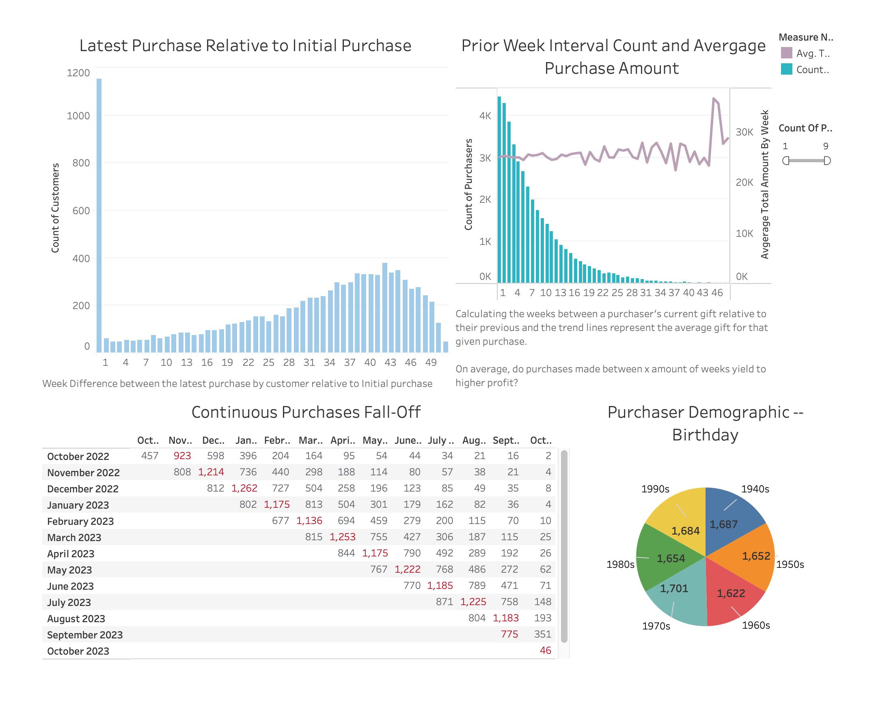

# Consulting Demo <> E-Commerce Data Flow

<!-- TABLE OF CONTENTS -->
<details>
  <summary>Table of Contents</summary>
  <ol>
    <li>
      <a href="#about-the-demo">About The Demo</a>
    </li>
    <li>
      <a href="#project-overview">Project Overview</a>
      <ul>
        <li><a href="#sofwares-used">Softwares Used</a></li>
      </ul>
    </li>
    <li><a href="#how-to-run">How to Run</a></li>
    <li><a href="#kpi-tableau-visualization">KPI Tableau Visualization</a></li>
  </ol>
</details>


<!-- ABOUT THIS DEMO -->
## About This Demo

For a fictionalized E-Commerce startup, I designed a data warehouse capturing how data can be used
for reporting, analyzing and forecasting an organization's value. 
Data will be mocked using faker and then I will create a workflow scenario of how customers can behave when
purchasing goods. Once this workflow scenario is created, I will use DBT to create analytic models to capture 
particular KPIs such as attrition, customer lifetime value, etc. And finally, use Tableau to visualize these KPIs.

This demo will capture all the areas
of Engineering ranging from: `designing`, `mocking`, `processing`,`testing`, `analytics`, `visualizing` and `automating`.
I hope with this project, I can provide a holistic overview of the services that can be provided.   


<!-- PROJECT OVERVIEW -->
## Project Overview

- [x] Design E-Commerce data warehouse used in a hypothetical CRM (Salesforce).
- [x] Mock all given data models.  
- [x] Create a workflow scenario mocking purchasing behavior.
    - [x] Attrition of Customer purchases.
    - [ ] Business Model on customers that are subscribers.
    - [ ] CDC workflow capturing real time changes that the database might overwrite (subscriber data models).     
- [x] Create analytic models on different KPI metrics based on mocked CRM data.
    - [x] DBT models within different dimensions.
    - [x] DBT tests capturing data quality.    
    - [x] DBT docs for democratizing data and deployed via Github Actions. The docs can be found here: [consulting-demo dbt docs](https://aselvendran.github.io/consulting-demo/#!/overview?g_v=1).
- [x] Tableau Dashboard visualizing the KPIs created with the DBT analytic models.
- [x] Dockerized environment to be able to run this demo in any local setup.
- [x] Terraform with localstack environment so that deploying this from a local computing service can be seamless.


### Softwares Used
1. `DBT`
    1. Postgres Adapter  
2. `Python`
    1. Faker
3. `Docker`
4. `Terraform`
5. `Tableau`


<!-- HOW TO RUN -->
### How to Run

The `Makefile` contains all the steps to get this running on your local machine. 
To create the mocked workflow scenario data models, one can follow the Makefile commands:  

1. `run-postgres-container` -> spin up a local Postgres instance
2. `run-lapsed-workflow-scenarios` -> run the lapsed workflow scenario. This will create all the 
data models that the fictional CRM (Salesforce) will capture. Essentially the data warehouse. 
We have a `.env_sample` that controls how many records we can generate using the mock application. 
A useful bash command to create a container and tunnel into it. 
   ```sh
   docker run -t -i --rm demo_consulting
   ```
3. `run-dbt-models` -> execute analytic models once all the mocked data has been created.
4. `stop-remove-docker-container` -> stop & remove the container.
   


<!-- KPI TABLEAU VISUALIZATION -->
## KPI Tableau Visualization

Incase one does not have Tableau software available, I provided a screenshot of the different KPIs 
that I calculated. In Tableau, I used conditional formatting to highlight particular KPIs as well as
some calculated fields using LODs. My approach for Data Visualization is that all the heavy processing and calculation 
should happen in the analytics layer (DBT) and not in the visualization tool because when one deploys to production, 
the visualization query should be a simple to generate any graph. 

<p align="center">
  
</p>


The mocked data is random, therefore the visualizations will differ for each execution. 
The tableau dashboard can be found via [tableau dashboard workbook](visualizations/lapsed_customers/customer_purchase_dropoff.twb).
 